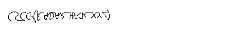

# Map Radar

The `Maze` series of challenges was one of my favorites in the CSCG. For all of these challenges I used the Linux version of the Game.

We are given a zip containing a game Executable and a few libraries and other assets of the game. For the first version of the game we were also given some sort of debug information on the game, however I never used that.

This is the fourth challenge I did in this series. If you don't understand why or when I did something, then you can try reading the writeups to the challenges before this one : `Maze - Emoji`, `Maze - Maze Runner`, `Maze - Tower`.

For this challenge we need to trace the path of a player called `The White Rabbit` and to do that we first need to have a look at the Protocol again:
```
00000000: 49 37 13 FF FF 00 05 10  54 68 65 20 57 68 69 74  I7......The Whit
00000010: 65 20 52 61 62 62 69 74                           e Rabbit
```

```
00000000: 50 37 13 FF FF 38 5D 4B  00 00 00 00 00 A8 D5 19  P7...8]K........
00000010: 00 48 77 FF FF 00 FE 03  00 C5 EC 36 00 41 60 03  .Hw........6.A`.
00000020: 00 00 00 00 00 00 C8 00  00 00 50 A7 01 00 00 78  ..........P....x
00000030: 20 C6 02 00 00 00 00 58  62 09 00 00 00 00 00 87   ......Xb.......
00000040: D0 1F 00 00 00 00 00 22  01 24 00 00 00 00 00 00  .......".$......
00000050: 00 00 00 00 50 29 00 00  00 45 09 21 00 00 00 00  ....P)...E.!....
00000060: 00 EE 1B 20 00 4F 2C 00  00 15 52 1E 00 00 00 00  ... .O,...R.....
00000070: 00 9C 92 09 00 00 00 00  00 00 00 00 00 00 50 19  ..............P.
00000080: 00 00 00 00 E3 26 2E 00  00 00 00 4A A3 14 00 DC  .....&.....J....
00000090: 05 00 00 6E 56 15 00 00  00 00 00 2F AF 00 00 00  ...nV....../....
000000A0: 00 00 00 00 90 01 00 00                           ........
```


Both of these packets were send from the server to the client and can therefore be reversed by looking at the games code (`ServerManager$$RecieveDataThread`). But this function is very long and ugly so I'm just gonna tell where the interesting data is. If you want you can try to reverse it yourself, before moving on, but let me tell you it is going to take a while.

The first packet is very easy it only contains a player id and a name. We need to parse this, because we need to know what the id of our rabbit is.
```python
def parse_player_name(raw, state):
    uid = struct.unpack("I", raw[:4])[0]
    name = str(raw[8:],"ascii")
    if name == B"The White Rabbit":
      state["rabbit_id"] = uid
```

The second packet is may more complicated and we only need one little detail from it: the position of `The White Rabbit`. This packet consists of `42` byte chunks. One chunk for each player. (Excluding the first identification byte). Each chunk looks like this:
```c
struct {
  uint32_t uid;
  uint64_t time;
  int32_t x;
  int32_t y;
  int32_t z;
  ... // (don't care)
}
```
So a parser function looks like this:
```python
def parse_player_info(raw, state):
    while len(raw) > 0:
      uid = struct.unpack("I", raw[:4])[0]
      if uid != state["rabbit_id"]
          raw = raw[42:]
          continue
      x,y,z = map(lambda x: x / 10000.0,struct.unpack("iii", raw[12:24]))
      return (x,y,z)
```
We can now change the proxy:
```python
import hexdump
import struct

def decode(b):
    r1 = b[0]
    r2 = b[1]
    res = bytes([])
    b = b[2:]
    for i in range(len(b)):
        r1 %= 255
        res += bytes([b[i] ^ r1])
        r1 = (r1 + r2) % 255
        r1 += r1 // 0xff
    return res

def parse_player_name(raw, state):
    uid = struct.unpack("I", raw[:4])[0]
    name = raw[7:]
    if name == B"The White Rabbit":
      state["rabbit_id"] = uid

def parse_player_info(raw, state):
    while len(raw) > 0:
      uid = struct.unpack("I", raw[:4])[0]
      if uid != state["rabbit_id"]:
          raw = raw[42:]
          continue
      x,y,z = map(lambda x: x / 10000.0,struct.unpack("iii", raw[12:24]))
      return (x,y,z)

def parse(data, port, origin, state):
    if origin == "client":
      return
    raw = decode(data)
    id = raw[0]
    raw = raw[1:]
    if id == ord("I"):
      parse_player_name(raw, state)
    if id == ord("P"):
      x,y,z = parse_player_info(raw, state)
      print(f"Player update : {x} / {y} / {z}")
```

This just dumps the positions and I couldn't see something inside those positions. The next thing I tried was to somehow plot these numbers

So I used PIL to create an Image where each pixel, that has been visited before gets made black.
```python
def parse(data, port, origin, state):
    if origin == "client":
      return
    raw = decode(data)
    id = raw[0]
    raw = raw[1:]
    if id == ord("I"):
      parse_player_name(raw, state)
    if id == ord("P"):
      x,y,z = parse_player_info(raw, state)
      print(f"c <-- s : Player update : {x} / {y} / {z}")
      ix = int(x)
      iy = int(z)
      if ix < 0 or ix > 240 or iy < 0 or iy > 80:
          print("[!] Rabbit out of image bound!")
          return
      state["img"].putpixel((ix,iy), 0)
      state["img"].save("image.png")
      print("Saved")

```
The resulting image looks like this



FLAG : `CSCG{RADAR_HACK_XYZ}`
