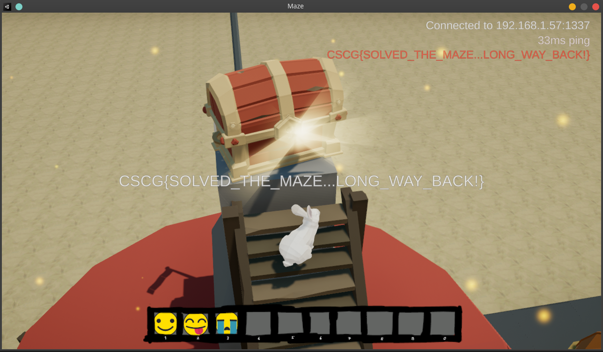
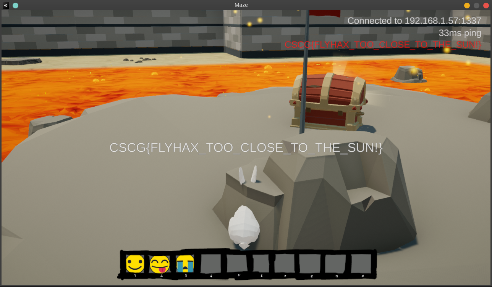

# Tower / The Floor is Lava

The `Maze` series of challenges was one of my favorites in the CSCG. For all of these challenges I used the Linux version of the Game.

We are given a zip containing a game Executable and a few libraries and other assets of the game. For the first version of the game we were also given some sort of debug information on the game, however I never used that.

This is the third challenge I did in this series. If you don't understand why or when I did something, then you can try reading the writeups to the challenges before this one : `Maze - Emoji` and `Maze - Maze Runner`.

I already had a "flyhack" programmed for the game from the last challenge. But to my disapointment we cannot use it to get over the walls of the maze. It seems like they extend infinitly into the air and if we try to cross one, the server teleports us back.
If you try to bypass a check or something like this it is always a good idea to think about how one could have implemented this check and what flaws this implementation could have. In this case, I would probably check every packet send by the client, weather or not it is inside a wall and if this is the case I would teleport the client back to the last vaild position.  But simply trick this implementation, by just sending one packet right before the wall and one packet right after the wall. As we never send a packet inside the wall, the server will never notice, that we passed the wall.

So I set myself the goal to implement this into the Proxy, because a implementation into the games code would be a lot more difficult.


## Protocol
If we want to control, the clients position, then we have to somehow tell the server and the client the new position and that is possible via two packets:

From the client to the server (position packet):
```
00000000: 50 2A E3 73 7C 86 D1 F4  F6 07 75 15 00 00 00 00  P*.s|.....u.....
00000010: 00 7A AF 19 00 84 E9 00  00 71 ED 09 00 00 00 00  .z.......q......
00000020: 00 D0 F9 27 00 00 00 00  00 00 00 00 00 00        ...'..........
```
And from the server to the client (teleport packet):
```
00000000: 54 01 70 AE 19 00 84 E9  00 00 66 ED 09 00        T.p.......f...
```

Let's have a closer look at the first one.
These a sequeltial packets, that means, there is not a big difference in position and rotaion between them.
```
00000000: 50 2A E3 73 7C 86 D1 F4  F6 CA 92 2D 00 00 00 00  P*.s|......-....
00000010: 00 29 CC 10 00 D6 02 00  00 B0 CD 01 00 00 00 00  .)..............
00000020: 00 BF AC 29 00 00 00 00  00 00 B0 04 00 00        ...)..........

00000000: 50 2A E3 73 7C 86 D1 F4  F6 42 9B 2D 00 00 00 00  P*.s|....B.-....
00000010: 00 02 69 10 00 D6 02 00  00 17 D3 01 00 00 00 00  ..i.............
00000020: 00 B8 AC 29 00 00 00 00  00 00 B0 04 00 00        ...)..........

00000000: 50 2A E3 73 7C 86 D1 F4  F6 5D A4 2D 00 00 00 00  P*.s|....].-....
00000010: 00 2F FE 0F 00 D6 02 00  00 E9 D8 01 00 00 00 00  ./..............
00000020: 00 B3 AC 29 00 00 00 00  00 00 B0 04 00 00        ...)..........

00000000: 50 2A E3 73 7C 86 D1 F4  F6 7A AD 2D 00 00 00 00  P*.s|....z.-....
00000010: 00 30 94 0F 00 D6 02 00  00 AF DE 01 00 00 00 00  .0..............
00000020: 00 AD AC 29 00 00 00 00  00 00 B0 04 00 00        ...)..........

00000000: 50 2A E3 73 7C 86 D1 F4  F6 F4 B5 2D 00 00 00 00  P*.s|......-....
00000010: 00 27 56 0F 00 D6 02 00  00 10 E2 01 00 00 00 00  .'V.............
00000020: 00 AB AC 29 00 00 00 00  00 00 40 01 00 00        ...)......@...

00000000: 50 2A E3 73 7C 86 D1 F4  F6 68 BE 2D 00 00 00 00  P*.s|....h.-....
00000010: 00 88 51 0F 00 D6 02 00  00 51 E2 01 00 00 00 00  ..Q......Q......
00000020: 00 AB AC 29 00 00 00 00  00 00 00 00 00 00        ...)..........
```
The first 9 bytes are constant: `50 2A E3 73 7C 86 D1 F4 F6`. The first byte is a packet identifier and `2A E3 73 7C 86 D1 F4 F6` is a player identifier.
After that we have got a 64bit little endian integer. It only increases an d at a static rate. That's why I assume, it's some kind of time value.

After that there are three 4 bit signed integers. I know this because there a locations on the map where they flip from a low value to a high one (and because a reversed the game a bit more). These are the `x`, `y` and `z` coordinates of the player. All of those are scaled by `10000`.

Next are 4 bit signed ints. These are euler angler, but only the second component is used.

The next byte are some kind of flags. (Player pressed jump, player is Landing again etc.)

The last 4 bytes are 2 signed shorts with the horizontal and vertical speed.

If we want to craft a vaild position packet we need to know a lot of things, but we can also copy a few things from the last send packet from the client.
* `time` we can take the last value + 1
* `angle` just copy the last values
* `flags` set to 0
* `v/h speed` also set it to 0 (server tollerates that)

The packet from the server to the client is much easier:
```
00000000: 54 01 70 AE 19 00 84 E9  00 00 66 ED 09 00        T.p.......f...
```

* 1st byte: packet identifier
* 2nd byte: teleport type (1 for this kind and 2 for teleporters)
* 3 32-bit signed int: position

To craft such a packet we only need the position.

## Proxy
To store the last values for the angle, time and position. I created a variable
```python
state = {"last_angle":None, "last_time":None, "last_pos":None}
```
Which is passed to every call of parse.
In the parser I also have made changes :
```python
def client_pos(raw, state):
    stime,x,y,z,ax,ay,az,flags,hspeed,vspeed = struct.unpack("=Qiiiiiichh",raw)
    state["last_angle"] = ay
    state["last_time"] = stime
    state["last_pos"] = (x / 10000.0,y / 10000.0,z / 10000.0)


def parse(data, port, origin, state):
    raw = decode(data)
    if origin == "client" and raw[0] == ord("P"):
        client_pos(raw, state)
```

To the proxy I also made some changes:
```python

def parse_mc_coord(coord, lastval):
    if coord == "~":
        return lastval
    if coord.startswith("~"):
        return lastval + float(coord[1:])
    return float(coord)

def coord(x):
    return int(x * 10000)

usersecret  = bytes.fromhex("f6f4d1867c73e32a")[::-1]


while True:
    x = input()
    args = x.split()
    try:
        if args[0] == "S":
            data = b"\0\0" + bytes.fromhex(args[1]) # easy way to encode
            p2s.forward(data)
            print("Data was send")
        if args[0] == "C":
            data = b"\0\0" + bytes.fromhex(args[1]) # easy way to encode
            g2p.forward(data)
            print("Data was send")
        if args[0] == "T":
            nx,ny,nz = map(coord, [parse_mc_coord(args[i+1], state["last_pos"][i]) for i in range(3)])

            packetS = b"\0\0P" + usersecret + struct.pack("=QiiiiiiBhh", state["last_time"] + 1,nx,ny,nz,0,state["last_angle"],0,0,0,0)
            packetC = b"\0\0T\x01"          + struct.pack("iii", nx,ny,nz)

            p2s.forward(packetS)
            g2p.forward(packetC)
            print("Teleport done")


    except Exception as e:
        print('injector :', e)
```
You can now use the `T <x> <y> <z>` command and set the position of the player. But if it teleports you into a wall or too far away the server will port you back. But luckely it's enough to get trough a wall.

Use one of:
```
T ~-10 ~ ~
T ~10 ~ ~
T ~ ~ ~-10
T ~ ~ ~10
```
 while standing right infront of a wall to go trough it.
 The command parses Mincraft command coordinates, which means that `~` is the current value and the number after it is an offset.

 With this technique you can reach both the tower and the Lava chest.



