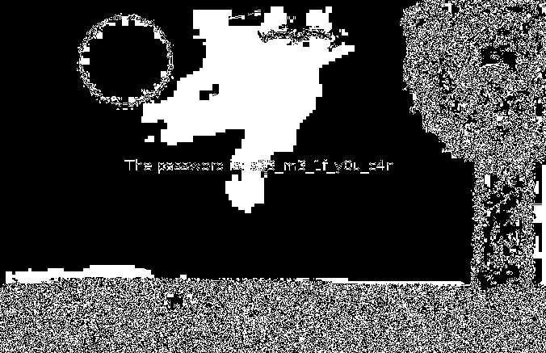

# Intro Stegano 3

For this stego challange we are given only an image: `chall.png`
After running a few different tools on the file I was sucessful with `stegsolve`


It is a bit hard to read, but it says: `The password is s33_m3_1f_y0u_c4n`
A few tool later I found something with `binwalk`:

```bash
$ binwalk chall.png

DECIMAL       HEXADECIMAL     DESCRIPTION
--------------------------------------------------------------------------------
0             0x0             PNG image, 676 x 437, 8-bit/color RGBA, non-interlaced
99            0x63            Zlib compressed data, best compression
299068        0x4903C         Zip archive data, encrypted compressed size: 48, uncompressed size: 28, name: flag.txt
299266        0x49102         End of Zip archive, footer length: 22
$ dd if=chall.png bs=1 skip=299068 count=220 of=flag.zip
220+0 records in
220+0 records out
220 bytes copied, 0.000523318 s, 420 kB/s
$ 7z x flag.zip

7-Zip [64] 16.02 : Copyright (c) 1999-2016 Igor Pavlov : 2016-05-21
p7zip Version 16.02 (locale=en_US.UTF-8,Utf16=on,HugeFiles=on,64 bits,16 CPUs AMD Ryzen 7 3700X 8-Core Processor              (870F10),ASM,AES-NI)

Scanning the drive for archives:
1 file, 220 bytes (1 KiB)

Extracting archive: flag.zip
--
Path = flag.zip
Type = zip
Physical Size = 220


Enter password (will not be echoed):
Everything is Ok

Size:       28
Compressed: 220
$ cat flag.txt
CSCG{H1dden_1n_pla1n_s1ght}
```
As the password I used the found string `s33_m3_1f_y0u_c4n`. 
